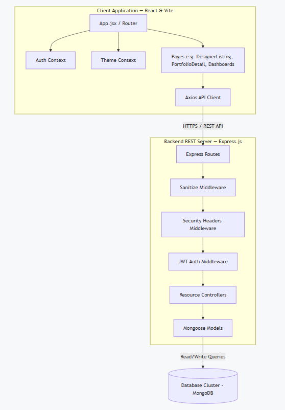
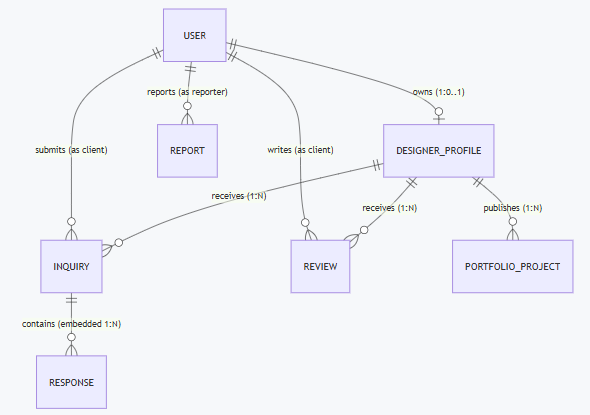
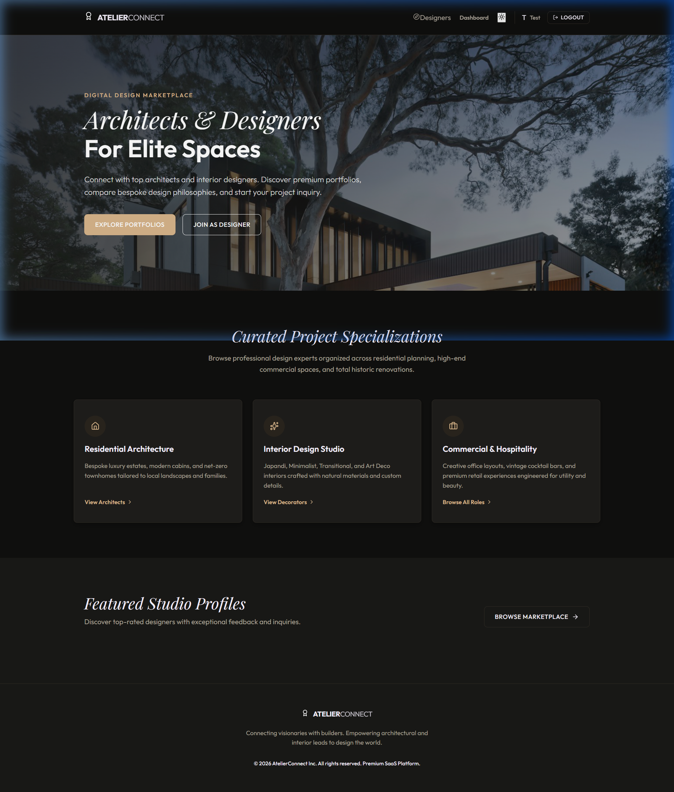
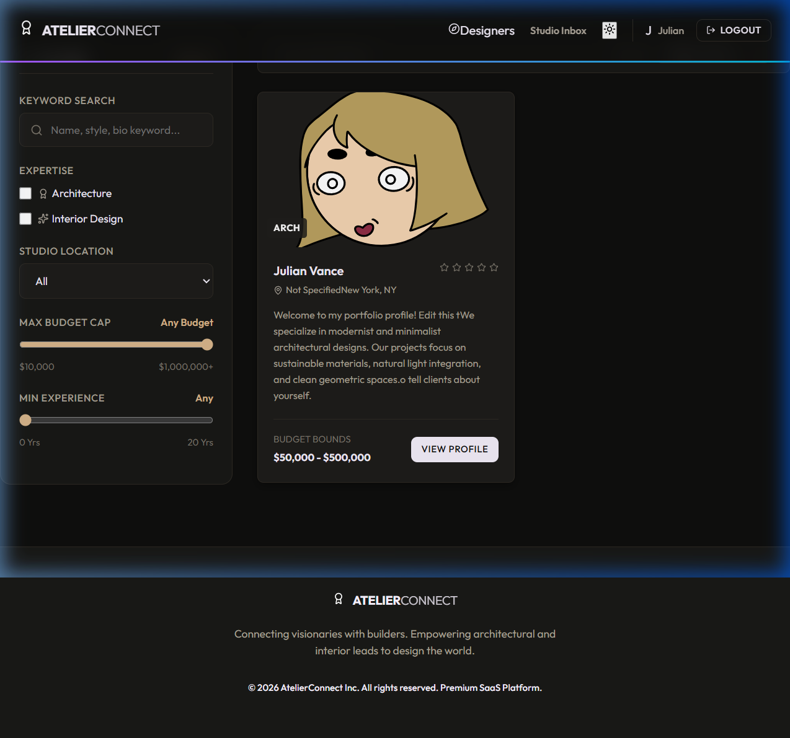
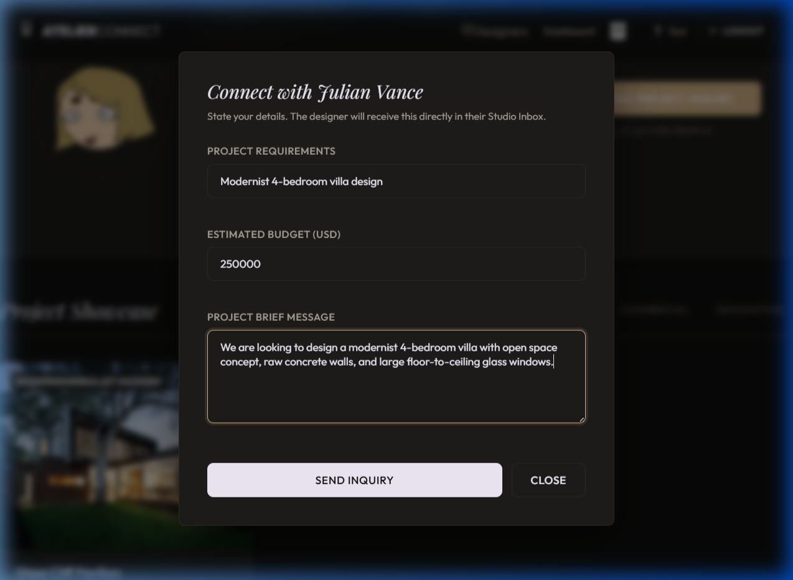
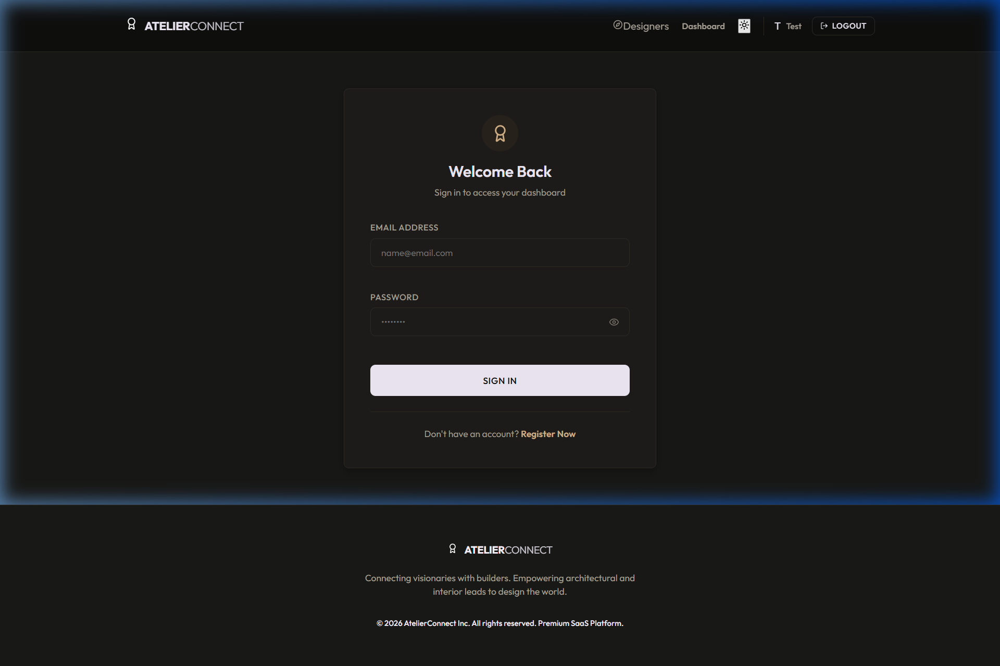
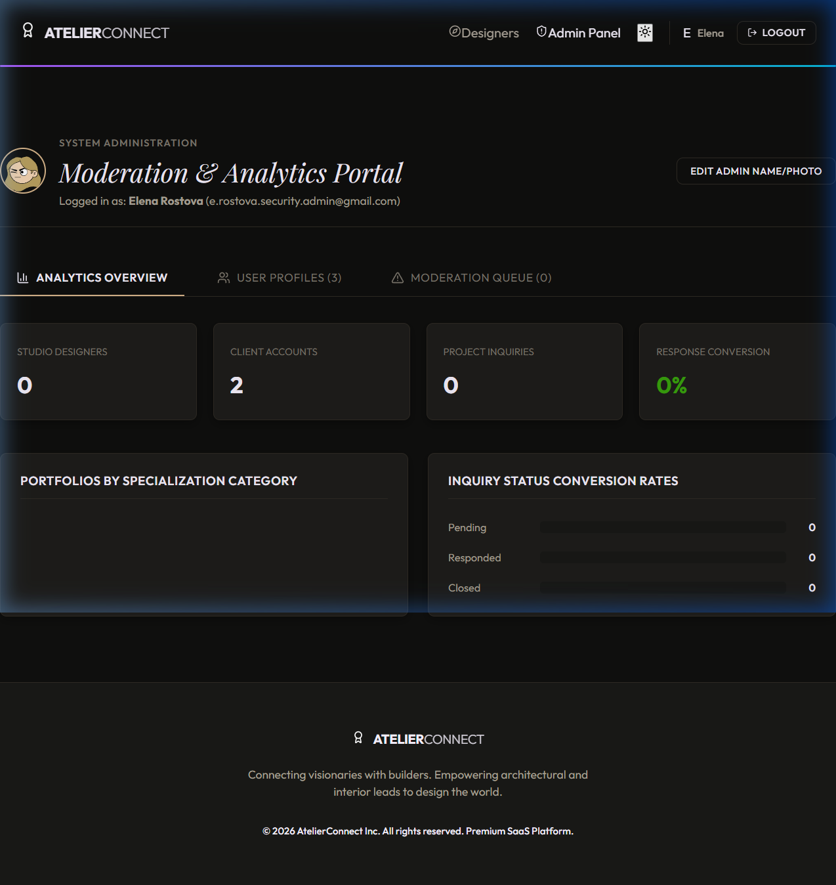

# DETAILED PROJECT REPORT
# AtelierConnect
### Unified Architect & Interior Designer Portfolio & Client Inquiry Platform

**Prepared July 2026**

---

## 1. Executive Summary

**AtelierConnect** is an end-to-end full-stack web application built to streamline and secure the connection between independent architects/interior designers and prospective clients. Traditionally, clients looking to hire professionals navigate a highly fragmented ecosystem consisting of unauthenticated social media portfolios, lack of pricing transparency, and insecure communications. 

AtelierConnect addresses these gaps by implementing a secure monorepo application containing a high-performance **React.js (Vite)** client-side application and a robust **Node.js/Express.js REST API** server powered by **MongoDB**. The platform handles the complete lifecycle of a professional creative engagement: designer profile onboarding, project portfolio management (CRUD), interactive client discovery with advanced location/style/budget filtering, secure rating and review compilation, structured project inquiries with embedded messaging chats, and administrative moderating oversight.

---

## 2. Problem Statement

The premium interior design and architectural services ecosystem suffers from several critical friction points that affect both professionals and clients:

1. **Disjointed Portfolios and Portals** – Clients browse inspiration on one site, check designer reviews on another, and coordinate project scoping over back-and-forth email chains, leading to communication gaps.
2. **Lack of Budget and Location Alignment** – Clients frequently contact high-end designers only to realize their project budget falls below the designer's minimum threshold, or that the designer does not operate in their local region.
3. **Review Vulnerability and Astroturfing** – Many existing directories allow anonymous or unverified users to write reviews, damaging trust and leading to unauthentic designer ratings.
4. **Poor Scoping Inquiries** – Initial inquiries sent to designers are often vague (e.g., "I want to renovate my kitchen, how much?"), requiring extensive follow-up questions to understand basic parameters like location, style, and budget constraints.
5. **No Designer Dashboard Management** – Independent design studios lack integrated tools to manage incoming client proposals, coordinate active project requests, or showcase dynamic, high-resolution media portfolios.

---

## 3. Product Solution & Value Propositions

AtelierConnect resolves these issues by consolidating the discovery and scoping process into a secure, single-portal environment built around five core pillars:

> **1. Upfront Budget and Location Alignment**  
> Designers explicitly define location constraints and budget ranges (minimum to maximum limits). Client searches dynamically cross-reference these criteria to prevent mismatching before contact is initiated.

> **2. High-Integrity Client Reviews**  
> The system enforces authenticated, single-review policies via unique database-level indexes. Clients can submit exactly one review per designer, ensuring ratings reflect genuine project collaborations.

> **3. Structured Scoping Flow**  
> The inquiry checkout flow guides clients to input detailed project requirements, select specific budget ceilings, and provide concrete project summaries, transforming vague requests into actionable proposals.

> **4. Centralized Studio Inbox**  
> Designers gain a custom workspace to manage incoming inquiries, update the statuses of project conversations (pending, responded, closed), and exchange messages directly in-app.

> **5. Platform-Wide Moderation Safeguards**  
> Integrated flag-and-report systems enable clients and admins to report offensive projects or profiles, with admin features to suspend users instantly to protect system integrity.

---

## 4. Key Application Features

Access to AtelierConnect is partitioned across three core roles, each with its own dashboard and granular permission structures.

### A. Clients (Property Owners / Consumers)
* **Interactive Landing Page**: Displays platform benefits, category tags, and direct navigation links to look for designers.
* **Designer Discovery Catalog**: A search directory with filters for location, style preferences, budget limits, and expertise tags (e.g., Architecture, Interior Design).
* **Portfolio Showcase & Lightbox**: Interactive gallery displaying designer portfolio items with modal-based close-ups for examining project renders.
* **Client Dashboard**: Centralized screen to track active inquiries, review status, exchange messages with designers, and view previously written ratings.
* **Review System**: Numeric star rating and written feedback module with auto-update hooks for the designer's overall score.

### B. Designers (Architects & Interior Designers)
* **Profile Onboarding Wizard**: Interface to define biography, expertise tags, locations, experience years, and budget minimums/maximums.
* **Portfolio Project Builder (CRUD)**: Create, read, update, and delete specific projects, including images, stylistic categories, and detailed descriptions.
* **Studio Inbox & Chat**: Centralized hub to view incoming client leads, toggle project statuses, and chat in real-time with prospective clients.
* **Rating Analytics**: Automated calculation of average scores based on verified reviews.

### C. Platform Administrators
* **Live System Metrics**: Live counters showing total registered clients, designers, and projects on the platform.
* **Category Analysis**: Visual representation of project distribution across design categories (Residential, Commercial, Renovation, Landscape, Other).
* **System Moderation**: Dedicated queue of flagged reports (users and projects) with resolve buttons and single-click suspension controls.
* **Database Utilities**: Diagnostic controls to purge test datasets and reset system configurations.

---

## 5. System Architecture & Tech Stack

AtelierConnect is built as a modular monorepo, cleanly separating user interactions, API endpoints, and the persistence tier.

### Technical Specifications

| Layer | Details |
| :--- | :--- |
| **Frontend** | React 19 (Vite) with Client-Side Routing (`react-router-dom`). Global state managed via `AuthContext` and `ThemeContext`. Custom modern theme styled using Vanilla CSS3, with SVG graphics provided by `lucide-react`. |
| **Backend** | Node.js and Express.js REST API using MVC directory structure. |
| **Database** | MongoDB database accessed via Mongoose Object-Document Mapper (ODM). Configured for high flexibility, supporting both in-memory local servers for automated testing and MongoDB Atlas cloud connections. |
| **Input Sanitization** | Custom middleware recursively sweeps request parameters to prevent NoSQL operator injection. |
| **Security Headers** | Custom security headers middleware applying strict Content Security Policy (CSP), anti-clickjacking protection, HSTS, and XSS blocks. |
| **Authentication** | JSON Web Tokens (JWT) using cryptographically signed secrets, stored securely in client state/headers with bcryptjs password hashing. |

---

## 6. Database Design & Entity Model

The backend model layer is built on 6 MongoDB collections. The database design maps the relationships between users, designer portfolios, project scoping inquiries, reviews, and administration reports.

### Relationship Summary
1. **User Ownership**: A User owns exactly one optional `DesignerProfile` (if their role is `designer`).
2. **Portfolio Submissions**: A `DesignerProfile` publishes multiple `PortfolioProjects`.
3. **Inquiry Lifecycle**: A User (client role) submits an `Inquiry` to a specific `DesignerProfile`. Each Inquiry embeds an array of messages representing the chat history (`Response` sub-documents).
4. **Review Uniqueness**: A User (client role) writes a `Review` for a `DesignerProfile`. A unique compound index prevents duplicate submissions.
5. **System Reports**: A User reports a target (either another User or a PortfolioProject), creating a `Report` record for administrative moderation.

### Key Schemas

#### User Collection
* **name** *(String, Required)*: Full name of the user.
* **email** *(String, Required, Unique)*: Lowercase user email.
* **passwordHash** *(String, Required)*: Bcrypt-hashed password.
* **role** *(String, Enum: 'client', 'designer', 'admin')*: Active platform role.
* **suspended** *(Boolean, Default: false)*: Indicates if user access is blocked by admin.
* **profilePhoto** *(String)*: Custom avatar image URL.
* **isEmailVerified** *(Boolean, Default: false)*: Verifies email status.
* **emailVerificationToken / Expires** *(String / Date)*: Expiry verification logs.
* **resetPasswordToken / Expires** *(String / Date)*: Password recovery parameters.
* **createdAt** *(Date)*: Record creation timestamp.

#### DesignerProfile Collection
* **userId** *(ObjectId, Ref: User, Unique)*: Associated user login document.
* **expertise** *(Array of Strings)*: Skills tags, e.g., `['architecture', 'interior_design']`.
* **experienceYears** *(Number, Required)*: Total years of professional design work.
* **location** *(String, Required)*: Base geographic location.
* **budgetMin / budgetMax** *(Number, Required)*: Dynamic budget boundary requirements.
* **bio** *(String, Required)*: Detailed designer bio statement.
* **profilePhotoUrl** *(String)*: Direct profile photo link.
* **avgRating** *(Number, Default: 0)*: Rolling calculation of ratings.

#### PortfolioProject Collection
* **designerId** *(ObjectId, Ref: DesignerProfile)*: Parent designer profile reference.
* **title** *(String, Required)*: Project name.
* **description** *(String, Required)*: Scope, goals, and design details.
* **images** *(Array of Strings, Min Length: 1)*: Array of project renders/photos.
* **style** *(String, Required)*: Styling tag, e.g., Modern, Minimalist, Scandinavian.
* **category** *(String, Enum: 'Residential', 'Commercial', 'Renovation', 'Landscape', 'Other')*: Functional design classification.

#### Inquiry Collection
* **clientId** *(ObjectId, Ref: User)*: Originating client reference.
* **designerId** *(ObjectId, Ref: DesignerProfile)*: Receiving designer profile reference.
* **projectRequirement** *(String, Required)*: Project scoping requirements.
* **budget** *(Number, Required)*: Target client budget limit.
* **message** *(String, Required)*: Initial inquiry proposal message.
* **status** *(String, Enum: 'pending', 'responded', 'closed')*: Active inquiry workflow state.
* **responses** *(Array of ResponseSchema)*: Embedded thread of chat responses:
  * **senderRole** *(String, Enum: 'client', 'designer')*
  * **message** *(String)*
  * **timestamp** *(Date)*

#### Review Collection
* **clientId** *(ObjectId, Ref: User)*: Reviewer reference.
* **designerId** *(ObjectId, Ref: DesignerProfile)*: Target designer reference.
* **rating** *(Number, Min: 1, Max: 5)*: Core numeric rating.
* **feedback** *(String, Required)*: Written user feedback.
* **Compound Index**: `{ clientId: 1, designerId: 1 }` with `unique: true` constraint.

#### Report Collection
* **reportedBy** *(ObjectId, Ref: User)*: Submitting user reference.
* **targetType** *(String, Enum: 'user', 'project')*: Content type of the flag.
* **targetId** *(ObjectId, Required)*: Unique ID of the flagged record.
* **reason** *(String, Required)*: Reason for filing the moderation report.
* **status** *(String, Enum: 'open', 'resolved')*: Flag status.

---

## 7. UI Walkthrough

AtelierConnect is styled using a modern, dark/light-mode toggled interface with responsive CSS grid and flexbox layouts.

### A. Landing Page (`Home.jsx`)
* **Dynamic Welcome**: A clean hero section with dual CTAs ("Browse Designers" and "Join as Designer").
* **Benefits Showcase**: Grid displaying platform features: Verified Portfolio Reviews, Upfront Budget Limits, Direct Message Scoping, and Live Moderation.
* **Statistics Bar**: Real-time platform count indicators displaying active projects and registered professionals.

### B. Designer Catalog Directory (`DesignerListing.jsx`)
* **Categorized Lists**: View designer cards displaying names, average ratings, location, experience years, and starting budgets.
* **Filter Sidebar**: Live controls to filter by location, style (e.g., Japandi, Industrial, Modern), expertise, and budget boundaries.
* **Interactive Sorting**: Instantly sort results by rating (high to low) or experience years (descending).

### C. Portfolio and Designer Details (`PortfolioDetail.jsx`)
* **Designer Hero Banner**: Clean header containing the designer's details, bio, and total experience.
* **Image Lightbox Component**: Renders a custom gallery of portfolio projects. Clicking on images opens a full-screen, responsive image lightbox modal for detailed inspection.
* **Ratings Queue**: Displays written feedback and numeric ratings.
* **Structured Inquiry Card**: Embedded form to submit detailed project requirements, specified budgets, and introductory messages to start a conversation.

### D. Login Interface (`LoginRegister.jsx`)
* **Glassmorphic Login Card**: Secure and responsive credentials entry fields with instant form validation feedback.
* **Role Redirection**: Dynamic login handler redirects authenticated users directly to their designated dashboard workspace (Client, Designer, or Admin).

### E. Client Inquiry Manager (`ClientDashboard.jsx`)
* **Scoping List**: Track all submitted inquiries with color-coded status badges (`pending`, `responded`, `closed`).
* **Active Messaging Console**: Select an inquiry to open a messaging interface and chat directly with the designer.
* **My Reviews Manager**: Review previously submitted ratings and edit or delete them.

### F. Studio Dashboard (`DesignerDashboard.jsx`)
* **Incoming Proposal Manager**: Panel displaying incoming inquiries from clients. Designers can reply to messages and toggle the inquiry status.
* **Profile Settings Editor**: Update locations, experience levels, and budget ranges in real-time.
* **Portfolio Project CRUD Panel**: Simple dashboard to add new portfolio items, edit styling details, or delete stale project renders.

### G. Administrative Moderation Panel (`AdminPanel.jsx`)
* **Metric Counter Counters**: View total client and designer registers.
* **Category Distribution Chart**: Visual indicator illustrating the percentage breakdown of projects (e.g., Residential vs Commercial).
* **Moderation Feed**: Lists open abuse or inappropriate content reports, allowing admins to suspend users or dismiss claims instantly.

---

## 8. Implementation & Production Security

AtelierConnect implements multi-layered security measures across the client, API server, and database configuration:

### 1. Strict Environment Variable Auditing
At server startup, `validateEnv()` executes checks using strict rules. It validates that critical strings (`MONGODB_URI`, `JWT_SECRET`) are present. In production mode, weak defaults (e.g., development secret strings) are rejected, forcing the server to shut down immediately with clean error logs.

### 2. JWT Authentication & Password Security
User passwords are encrypted with `bcryptjs` using a salt work factor of 10. Sessions are authorized using JSON Web Tokens (JWT) signed with the system's cryptographically secure secret. 

### 3. Protection Against NoSQL Operator Injection

### 4. Custom HTTP Security Headers
The server configures response headers to enforce browser-level security policies:
* `X-Content-Type-Options: nosniff`: Prevents MIME type sniffing attacks.
* `X-Frame-Options: DENY`: Blocks clickjacking by preventing the application from being embedded in unauthorized frames or iframes.
* `X-XSS-Protection: 1; mode=block`: Activates native browser XSS filters.
* `Referrer-Policy: strict-origin-when-cross-origin`: Minimizes information disclosure across origins.
* `Content-Security-Policy`: A policy that restricts resources to trusted origins and fonts.
* `Strict-Transport-Security` (HSTS): Enforces HTTPS connections.

### 5. Cross-Origin Resource Sharing (CORS) Controls
CORS is restricted to specified domains loaded from environment variables (`ALLOWED_ORIGINS`). In development, it defaults to allowing localhost requests (`http://localhost:5173`).

---

## 9. Conclusion & Next Steps

AtelierConnect provides a unified marketplace for clients and design professionals. By bringing portfolio displays, pricing transparency, scoping, and messaging into a single application, it reduces coordination friction while maintaining high review integrity and server-side security.

### Future Roadmap
1. **Payment Gateways Integration** – Incorporate Stripe or Razorpay to process security deposits and milestone payments directly within the inquiry workflow.
2. **Real-Time Communication Websockets** – Implement Socket.io to convert the inquiry response sections into a live chat interface with push notifications.
3. **Immersive 3D Walkthroughs** – Add WebGL and Three.js elements to portfolio projects, allowing designers to upload interactive 3D floor plans and virtual reality models.
